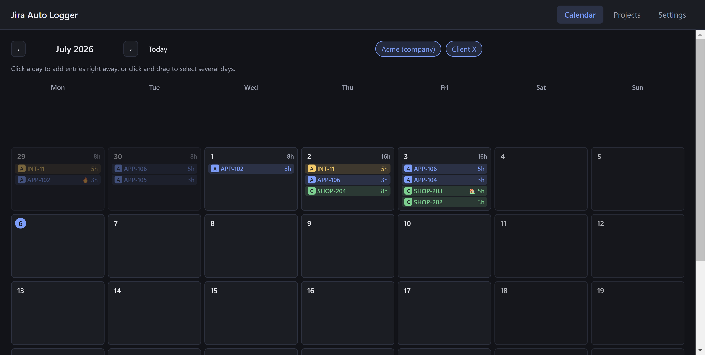
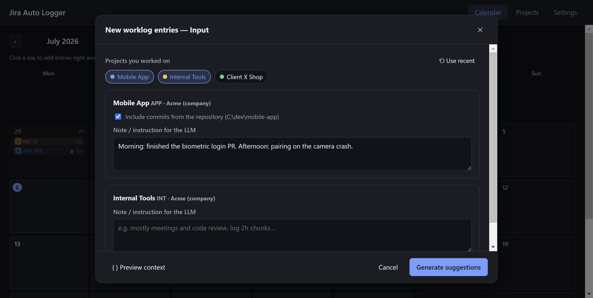
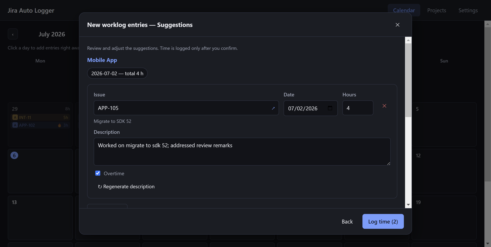

# Jira Auto Logger

A cross-platform desktop app (Electron — Windows/macOS/Linux) that suggests Jira/Tempo worklog entries based on your git commits and free-form notes, using an LLM of your choice. You always review and edit every suggestion before any time is logged.



## How it works

1. The **calendar** shows your existing Tempo worklogs, merged from all active Jira connections. Entries are tinted with their project's color; custom-field markers (e.g. 🔥 overtime) are shown next to the hours. Click a day to add entries right away, or click-and-drag to select a range.
2. In the popup you pick which **projects** you worked on, optionally include commits from each project's repository and add a note per project.

   

3. Each project gets its own **isolated LLM pass** — the model only sees that project's issues, commits, recent worklogs (as style examples) and notes. It never invents issue keys: suggestions are validated against real issues fetched from Jira.
4. You review the suggestions — issue (searchable picker with type badges), date, hours, description, custom fields — regenerate descriptions with a hint if needed, and only then log the time to Tempo.

   

## Features

- **Multiple Jira connections** — e.g. your company's Jira and a client's Jira, each with its own Tempo token. Toggle active connections on the calendar; one generation can log the same day into several Jiras.
- **Projects** ([screenshot](screenshots/projects.png)) — a project pins a Jira project of one connection, an optional git repository (with a per-repo commit author filter) and a standing LLM instruction. Each project has a color used in the calendar.
- **LLM backends**: Claude CLI, GitHub Copilot CLI or the OpenAI API, with model selection, a thinking on/off switch and a fully editable main prompt. Expired Claude CLI sessions are detected and the login flow can be launched from the app.
- **Custom worklog fields** (Tempo work attributes) — boolean or text, imported from the API or added manually, optionally auto-filled by the LLM, optionally marked in the calendar with an icon.
- **Debug tools** — preview of the exact prompt (with a token estimate) before sending, and a diagnostic log file (paths shown at the bottom of settings, [screenshot](screenshots/settings.png)).
- **Two languages** (Polish/English) and **themes**: dark, light, Windows 95, Fallout terminal.
- Tokens are encrypted with the OS keychain (`safeStorage`: DPAPI/Keychain/libsecret); the rest of the config is a plain JSON in the userData directory.

## Getting started

```bash
npm install
npm run dev        # development mode
npm run dev:mock   # development mode on fake data (no tokens needed) — see below
npm run build      # production build (out/)
npm run typecheck  # type checking
npm run dist:win   # Windows installer (also dist:mac, dist:linux)
```

### Configuration (Settings tab)

- **Jira + Tempo connections** — instance URL (`https://company.atlassian.net`), account e-mail and an [Atlassian API token](https://id.atlassian.com/manage-profile/security/api-tokens) (classic, without scopes), plus a Tempo API token (Tempo → Settings → API Integration, `Worklogs: Manage` scope). Both token pages open directly from the app.
- **Projects tab** — define your projects: name, Jira project, repository folder, commit author e-mail (or "include everyone's commits"), color, standing LLM instruction.
- **LLM backend** — provider, model, thinking switch, issue-pool tuning (how many recent issues are offered to the model) and the main prompt (placeholders: `{{input}}`, `{{workingHoursPerDay}}`, `{{language}}`).

## Mock mode

`npm run dev:mock` (or the `JAL_MOCK=1` env var / `--mock` argument) runs the whole app on deterministic fake data: two connections, three projects, six weeks of Tempo history, fake commits and a fake LLM with a realistic delay. Nothing is read from or written to your real config, and no network calls are made. Useful for development, UI work and trying the app out without any tokens.

`npm run screenshots` regenerates the images in this README: it launches mock mode, drives the UI automatically and captures every screen.

## Architecture

```
src/
  shared/    domain types + the typed IPC contract (no Electron/DOM dependencies)
  main/      logic: ConfigService, ConnectionManager, JiraClient, TempoClient,
             GitService, LlmService + providers (strategy: claude-cli / copilot-cli / openai-api),
             mock implementations of all external services
  preload/   contextBridge exposing the typed window.api
  renderer/  React UI: calendar, suggestion wizard, projects, settings,
             themes (CSS variables), i18n (Polish/English)
```

The renderer never talks to external APIs — everything goes through the main process and returns a serializable `Result`, so every error surfaces as a translated message. External services are behind interfaces (`JiraApi`, `TempoApi`, `CommitSource`, `LlmProvider`), which is also how mock mode plugs in.

All dependencies use MIT/Apache-2.0 licenses (no copyleft): React, zustand, i18next, date-fns, electron-vite, electron-builder, cross-env.
